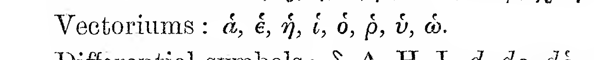
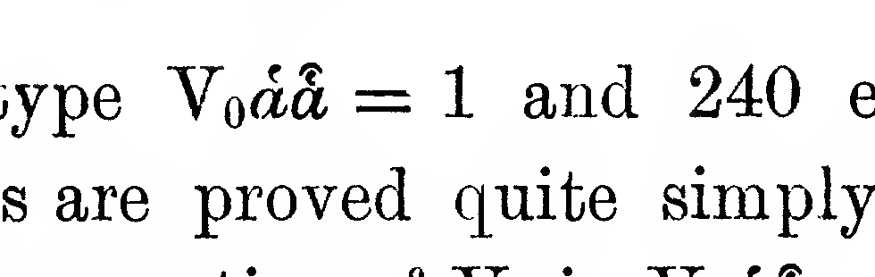
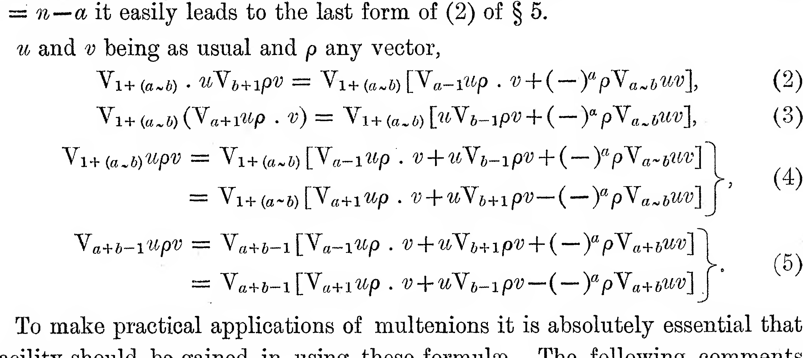
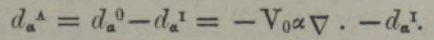

# McAulay transcription notes

`McAulay--Multenions and Differential Invariants-I-working-copy.tex` is the
active, progressively typeset transcription of Part I. It currently covers
journal pages 293--296 (PDF pages 2--5).

## Clean rendering workflow

- The primary responsibility is truth-faithfulness to the source. Transcribe
  what the scan prints, including ambiguous, unusual, or apparently
  inconsistent notation; record questions for later mathematical analysis, but
  do not silently interpret, correct, or normalize the source.
- Work from the page image, not the OCR text alone. OCR is useful for prose but
  loses equation structure, accents, and the placement of equation numbers.
- Retain the journal-page sequence: use one LaTeX page per source journal page,
  reproduce the running header, and begin continuation text where it appears in
  the scan.
- Reflow prose as ordinary paragraphs. Put standalone formulae in display-math
  environments, using `\tag{...}` when the original has an equation number.
- Verify symbols and tables at high-resolution against the source PDF before
  committing them to LaTeX.
- Compile with `pdflatex` and inspect the rendered PDF against the source page.

## Vectorium mark

The mark on vectorium variables is a small curved, inverted accent; it is not a
conventional hat. The working copy represents it with LaTeX `\breve{...}`. For
example, the source notation is rendered as
`\breve{\alpha}`, `\breve{\epsilon}`, `\breve{\eta}`,
`x\breve{\upsilon}`, and `\breve{\omega}`.

This is a visual historical approximation and should be retained consistently
unless a better documented original notation is identified.

## Normal-reciprocal notation (p. 305 onward)

The p. 305 normal-reciprocal relations introduce a second, distinct mark. Use
`\breve{\alpha}` for a vectorium and `\hat{\alpha}` for its normal reciprocal;
for example, $V_0\breve{\alpha}\hat{\alpha}=1$. Do not collapse this paired
notation into a single accent.

## Grouped equations: braces and punctuation

When the source groups alternative equation lines with a large right brace,
preserve the brace and its terminal punctuation before the equation number. In
LaTeX, use `\left.\begin{aligned} ... \end{aligned}\right\}` followed by the
source comma or period, then `\tag{...}`. Do not omit that punctuation. This
was audited and applied to the grouped displays on pp. 297--312; for example,
on p. 309 equation (4) ends with a comma and equation (5) with a period.

## Current handoff status (2026-09-12)

Part I has been transcribed and source-checked through its final journal page,
p. 324. The transcription ends at the article rule; the following Newman
article is deliberately excluded.

## Part II handoff status (2026-09-12)

`McAulay--Multenions and Differential Invariants-II-working-copy.tex` is the
active, source-checked transcription of Part II. It covers journal pp. 210--224;
resume at p. 225, checking every word, symbol, display, brace, equation number,
and page break against the source PDF. The calibration-factor notation on p. 218
is $h^c$, and p. 219 equation (9) retains its grouped right brace.

On p. 223 the source uses the literal glyph $9$ only as a subscript in the
displays following (12a)--(14a). It is transcribed as printed; its meaning must
be determined only in a later mathematical review.

### Follow-up: p. 220 variation identity

The closing display after ``It is thus easy to prove that'' on p. 220 has been
transcribed directly from the scan, including the repeated subscripted symbols
$\nabla_9$ and $\epsilon_9$. Its combination of terms appears potentially
inconsistent or otherwise unusual. Preserve the source transcription for now;
return to the identity for a mathematical and contextual check after the
surrounding derivation has been completed.

The same review must cover the increment definitions as a chain: p. 220 defines
$d_{\alpha}^{0}\tau$ and $d_{\alpha}^{A}\tau$ using
$d_{\alpha}^{T}\tau$, while p. 221 introduces the invariantive increment
$d_{\alpha}^{I}$ and sets $d_{\alpha}^{I}\tau=d_{\alpha}^{T}\tau$ for a
contravariant vector. The transcription preserves these source forms, but their
mathematical relation should be checked together before any editorial
normalization is attempted.

The supplied source rendering of p. 221 equation (8), to be treated as the
authoritative visual reference for this review, is
\[
d_{\alpha}^{A}=d_{\alpha}^{0}-d_{\alpha}^{I}=-V_{0\alpha}\nabla\mathbin{\cdot}-d_{\alpha}^{I}.
\]

In particular, $\alpha$ is a subscript and $A$, $0$, and $I$ are superscripts
on $d$; the terminal $d_{\alpha}^{I}$ is an operator term, not an omitted
operand. Revisit the expression's meaning, rather than changing the
source-faithful rendering, when auditing the mathematics.
