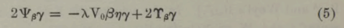
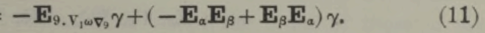

# McAulay transcription notes

`McAulay--Multenions and Differential Invariants-I-working-copy.tex` is the
active, progressively typeset transcription of Part I. It currently covers
journal pages 293--296 (PDF pages 2--5).

## Clean rendering workflow

- The primary responsibility is truth-faithfulness to the source. Transcribe
  what the scan prints, including ambiguous, unusual, or apparently
  inconsistent notation; record questions for later mathematical analysis, but
  do not silently interpret, correct, or normalize the source.
- Work from the page image, not the OCR text alone. OCR is useful for prose but
  loses equation structure, accents, and the placement of equation numbers.
- Retain the journal-page sequence: use one LaTeX page per source journal page,
  reproduce the running header, and begin continuation text where it appears in
  the scan.
- Reflow prose as ordinary paragraphs. Put standalone formulae in display-math
  environments, using `\tag{...}` when the original has an equation number.
- Verify symbols and tables at high-resolution against the source PDF before
  committing them to LaTeX.
- Compile with `pdflatex` and inspect the rendered PDF against the source page.

## Vectorium mark

The mark on vectorium variables is a small curved, inverted accent; it is not a
conventional hat. The working copy represents it with LaTeX `\breve{...}`. For
example, the source notation is rendered as
`\breve{\alpha}`, `\breve{\epsilon}`, `\breve{\eta}`,
`x\breve{\upsilon}`, and `\breve{\omega}`.

This is a visual historical approximation and should be retained consistently
unless a better documented original notation is identified.

## Normal-reciprocal notation (p. 305 onward)

The p. 305 normal-reciprocal relations introduce a second, distinct mark. Use
`\breve{\alpha}` for a vectorium and `\hat{\alpha}` for its normal reciprocal;
for example, $V_0\breve{\alpha}\hat{\alpha}=1$. Do not collapse this paired
notation into a single accent.

## Grouped equations: braces and punctuation

When the source groups alternative equation lines with a large right brace,
preserve the brace and its terminal punctuation before the equation number. In
LaTeX, use `\left.\begin{aligned} ... \end{aligned}\right\}` followed by the
source comma or period, then `\tag{...}`. Do not omit that punctuation. This
was audited and applied to the grouped displays on pp. 297--312; for example,
on p. 309 equation (4) ends with a comma and equation (5) with a period.

## Current handoff status (2026-09-12)

Part I has been transcribed and source-checked through its final journal page,
p. 324. The transcription ends at the article rule; the following Newman
article is deliberately excluded.

## Part II handoff status (2026-09-12)

`McAulay--Multenions and Differential Invariants-II-working-copy.tex` is the
active, source-checked transcription of Part II. It covers its complete journal
span, pp. 210--240, ending at the article rule on p. 240. The calibration-factor notation on p. 218
is $h^c$, and p. 219 equation (9) retains its grouped right brace.

Page 237's four-level notation scheme is reproduced as a TikZ diagram; its
superscript labels are significant and the bracketed count labels are $(144)$,
$(36)$, $(6)$, and $(20)$.

### Follow-up: p. 238 non-contractile symbol

The symbol in equations (5)--(6), transcribed provisionally as
$\mathfrak{T}_{\beta\gamma}$, has a single stem and a blackletter-like form in
the scan. It is not a Greek capital Pi. Its exact historical typeface/character
identity should be established in a later typography review; preserve the
current transcription unless that review resolves it differently.

### Correction checked: p. 239 equation (8)

The left-hand side has the Eddington bold base but no left superscript:
$\mathbf{E}_{\beta\gamma}=E_{\beta\gamma}+Y_{\beta\gamma}$. The right-hand
E is Weyl's and is not bold. The same distinction applies to the E symbols in
equation (12), which are all unbolded.

On p. 223 the source uses the literal glyph $9$ as a subscript in the displays
following (12a)--(14a); the same literal glyph occurs in p. 239 equations
(11)--(12), as $E_9$ and $\nabla_9$. It is transcribed as printed; its meaning
must be determined only in a later mathematical review.

### Follow-up: p. 220 variation identity

The closing display after ``It is thus easy to prove that'' on p. 220 has been
transcribed directly from the scan, including the repeated subscripted symbols
$\nabla_9$ and $\epsilon_9$. Its combination of terms appears potentially
inconsistent or otherwise unusual. Preserve the source transcription for now;
return to the identity for a mathematical and contextual check after the
surrounding derivation has been completed.

The same review must cover the increment definitions as a chain: p. 220 defines
$d_{\alpha}^{0}\tau$ and $d_{\alpha}^{A}\tau$ using
$d_{\alpha}^{T}\tau$, while p. 221 introduces the invariantive increment
$d_{\alpha}^{I}$ and sets $d_{\alpha}^{I}\tau=d_{\alpha}^{T}\tau$ for a
contravariant vector. The transcription preserves these source forms, but their
mathematical relation should be checked together before any editorial
normalization is attempted.

The supplied source rendering of p. 221 equation (8), to be treated as the
authoritative visual reference for this review, is
\[
d_{\alpha}^{A}=d_{\alpha}^{0}-d_{\alpha}^{I}=-V_{0\alpha}\nabla\mathbin{\cdot}-d_{\alpha}^{I}.
\]

In particular, $\alpha$ is a subscript and $A$, $0$, and $I$ are superscripts
on $d$; the terminal $d_{\alpha}^{I}$ is an operator term, not an omitted
operand. Revisit the expression's meaning, rather than changing the
source-faithful rendering, when auditing the mathematics.

## Part III handoff status (2026-09-12)

`McAulay--Multenions and Differential Invariants-III-working-copy.tex` is the
active, source-checked transcription of Part III. It currently covers journal
pp. 162--173 (PDF pp. 1--12), through the total-energy derivation, equation
(25), on p. 173.

### Part III variance marks

Part III uses two distinct mark families. The $c$ and inverted,
upside-down $c$ (rendered as `\invc`, Unicode U+0254) occur in the printed
type labels, such as $c/\invc$. They do not occur in the variance indicators.
Those indicators are literal parentheses in left superscript position. The
source calls them substitutes for upright and inverted commas. Preserve their
number and order literally; for example, it prints
`$\phi=\markpair{(}{)}{\phi},\ \markpair{)}{(}{\phi},\ \markpair{(}{(}{\phi}\ \text{or}\ \markpair{)}{)}{\phi}$`.
`\markpair` renders both parentheses together as a left superscript. They are
meaningful notation, not grouping parentheses.

Compile the Part III working copy with `xelatex`: this renders `\invc` as the
explicit Unicode open-o/reversed-c glyph (U+0254). The `pdflatex` fallback is
only for source portability and is visually less distinct.

The p. 163 ``thick dot'' density notation is provisionally represented by
LaTeX `\dot{}`. The source says this dot had replaced a bar in 1922. Retain the
distinction between a density-marked symbol, such as $\dot\theta$, and an
ordinary multiplication dot when extending this transcription.

The p. 164 Maxwell forms apply the same density mark to $\omega$, $\kappa$,
and $v$; these are rendered as `\dot\omega`, `\dot\kappa`, and `\dot v`.

The p. 165 digression explicitly applies the paired parenthesis variance marks
to $N$ and $I$. Use `\markpair` for both marks, rather than treating them as
ordinary parentheses or apostrophes.

On p. 166, the same variance marks attach to linities including $\dot\psi$.
The notation for the normal/incident components uses true primes ($N'$ and
$I'$) in addition to the paired marks; retain both distinctions.

P. 167 continues the dot-marked linities $\dot\phi$ and $\dot\psi$, including
their inverse-density form. Preserve the dot and the true prime separately in
expressions such as $\dot\phi'$ and $\dot\psi^{-1}$.

The p. 168 stationary-action setup likewise uses density-marked mass and mass
density ($d\dot M$ and $\dot m$); retain the marks in the volume relation.

P. 169 introduces the density-marked momentum $\dot\mu$ and defines the
stationary-action density $W$. Its display (4), like p. 168 equation (2), is
introduced by a separate left-aligned ``and.''

P. 170's constrained field variation preserves the dot-marked $\omega$ and
$\kappa$; its differential-operator definition of $\omega^\times$ should not
be confused with an ordinary product by $\nabla$.

P. 171 distinguishes the quoted co-ordinate change $\delta'$ from the
post-displacement change $\delta$. Preserve both definitions and their grouped
relation in equation (14).

P. 172 derives the material contribution to the displacement variation. Keep
the dot-marked material variables $\dot m$ and $\dot\mu$ distinct from their
undotted counterparts in equations (16)--(19).

P. 173 introduces the self-conjugate operator $\theta\Pi$ and the total-energy
linity $T^{\bullet(t)}$. Keep its differential-operator use distinct from
ordinary multiplication in equations (20)--(25).

## Philosophical Magazine supporting extract

`../McAulay--Philosophical-Magazine--journal-pp-146-162.pdf` is a page-faithful
extract of journal pp. 146--162 from the July 1923 *Philosophical Magazine*
issue. It contains McAulay's ``Poisson's and Green's Theorems in Riemann's
$n$-manifold'' (pp. 146--155) and ``The Mechanical Forces indicated by
Relativity in an Electromagnetic Field'' (pp. 156--162). Keep this extract as
supporting reference material when checking the transformed Part III pp. 169
and 171.
